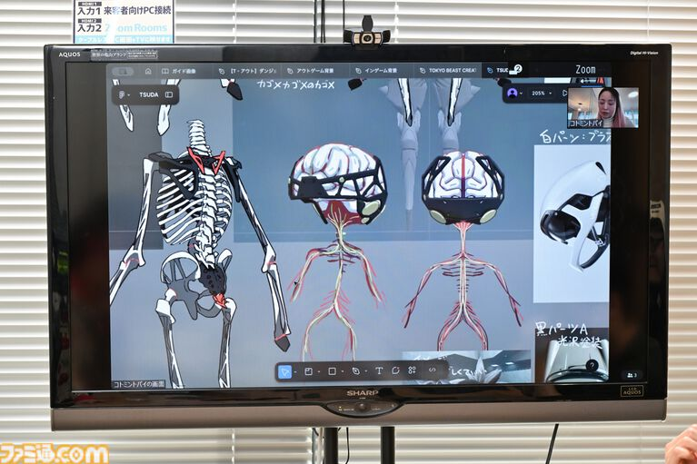
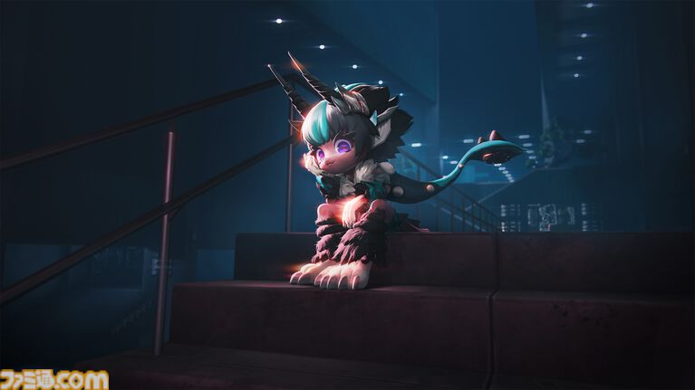

# ビーストは「ロボット」よりも「生物」に近い

ビーストは、見た目だけでなく**身体の構造そのものが生物に近い**。

その身体は生態的・発生学的な見地から製造され、エネルギー効率の面からも動物に近い作りになっている。

筋肉や人工筋肉があり、血管も通っている。

そのため、一般的にイメージされる硬質なロボットとは違い、かなり柔らかく、**動物の筋肉に近い身体**を持つ。

## タイプごとに異なる「生物らしさ」

ビーストのデザインは、生物それぞれの個性をもとに方向性が決められている。

パーツ単位で組み合わせても、どのタイプなのかを見分けられるようにする。

そこからさらに、生物としての特徴を強くしていく。

その代表的なタイプが**ファーリー**だ。

猫などの哺乳類を思わせる、いわゆる「ケモケモしい」デザイン。

もともとファーリーが愛玩用として製造され、人気を得たことが、後の多様化にもつながっていく。

## 「愛玩用」から過酷な労働力へ

ファーリーがヒットすると、そこから別の嗜好に向けた製品も作られるようになる。

そしてビーストは、単なる愛玩用の存在ではなくなっていく。

核施設で働くビースト。

小さな身体を利用して、汚水を除去するビースト。

人間やレプリカントが利用するために、**過酷な環境で働くことを想定したビースト**まで作られていく。

生物の特徴を取り入れて設計された身体は、かわいらしさを実現するだけでなく、さまざまな用途に合わせて特化するための身体でもあった。

ビーストの多様な姿は、単なるデザインの違いではない。

**「どんな生物的特徴を、何のために利用するのか」**

という発想から生まれた、多様な製造目的の結果でもある。
