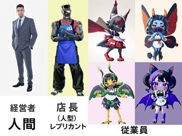

## 一般的なビーストは、人間とどれくらい会うのか？

一般的なビーストは、人間と直接会うことはあまりないらしい。

ビーストが人間社会の中で暮らしているとしても、だからといって人間と日常的に顔を合わせるとは限らない。

たとえば、こんな関係なのかもしれない。

**店長が人型レプリカントなら、ビーストは毎日のように店長と顔を合わせる。**

一方で、その店を経営している人間とは、ほとんど会うことがない。

極端に言えば、

> **「店長には毎日会うけれど、経営者には一生会わない」**

ということすらあり得る。

現実の感覚に置き換えるなら、一般的なビーストにとって人間は、**「芸能人と街中で偶然出会う」くらいの距離感**なのかもしれない。

そう考えると、ビーストにとっての「人間」と「人型レプリカント」は、かなり違った存在に見えてくる。

人間は、自分たちを作り、社会を動かしている存在。

けれど日常生活で接する相手は、むしろ同じレプリカントやビーストなのかもしれない。

では、もしある日。

**「人間に直接会う機会」が訪れたら、ビーストはそれを特別な出来事として感じるのだろうか？**

これは、ビーストたちの社会を考える上で、意外と面白いポイントかもしれない。
