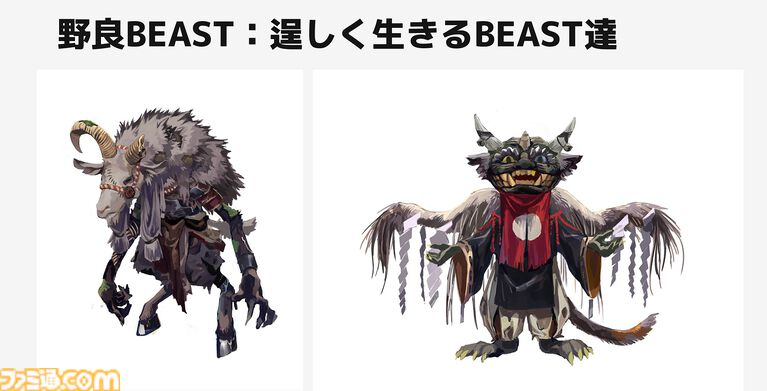
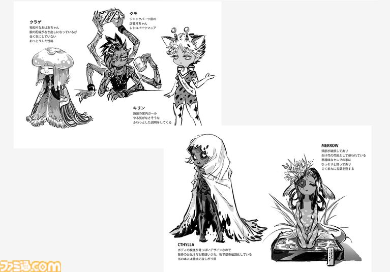

# 路頭に迷ったビーストたち――野良BEASTの生きる場所

愛玩用として大量に製造されたビースト。

しかし、人気がなくなった後も、ビーストには自由意志がある。

すべてが人間やレプリカントの社会に残るとは限らない。

中には、**そのまま自分たちだけで生きていくビースト**もいる。

公式インタビューでは、こうしたビーストたちを、妖怪じみた姿やボロボロの服装で描く構想が語られている。

## 都市の外側にいるビースト

こうした「野良BEAST」の姿には、サイバーパンク作品らしいイメージがある。

都市の中心ではなく、**郊外**。

トレーラーや河原など、人間の生活圏から少し離れた場所に住んでいる。

華やかな未来都市の裏側で、社会からこぼれ落ちたビーストたちがひっそりと暮らしている。

「100年後の東京」という舞台を考えると、こうした存在がいることも想像できる。

## 小さなコミュニティを作る

彼らは、ただ一匹ずつ孤立しているわけではない。

サイバーパンク作品では、社会から離れた人々が**小さなコミュニティを形成する**姿が描かれがちだという。

ビーストも同じように、自分たちだけの生活圏を作っていく可能性がある。

そして、そこでは都市社会とは異なる文化が育っていく。

## 独特な宗教まで生まれる

さらに興味深いのが、**独特な宗教を運営するコミュニティ**という発想だ。

すでにTOKYO BEASTの世界には、レプリカントやビーストが人間を信仰する宗教が存在する。

しかし、人間社会から離れて生きるビーストたちが集まった場所なら、そこからまた別の信仰や文化が生まれてもおかしくない。

公式インタビューでは、こうしたビーストたちは今後登場させたい存在として語られている。

ゲーム内ではまだ見る影もないとしても、世界設定がしっかり作られているからこそ、**「そういうビーストたちも、この世界のどこかにいるのだろう」**と想像できる。

華やかな大会の舞台から少し離れた場所にも、ビーストたちの別の人生が存在している。
