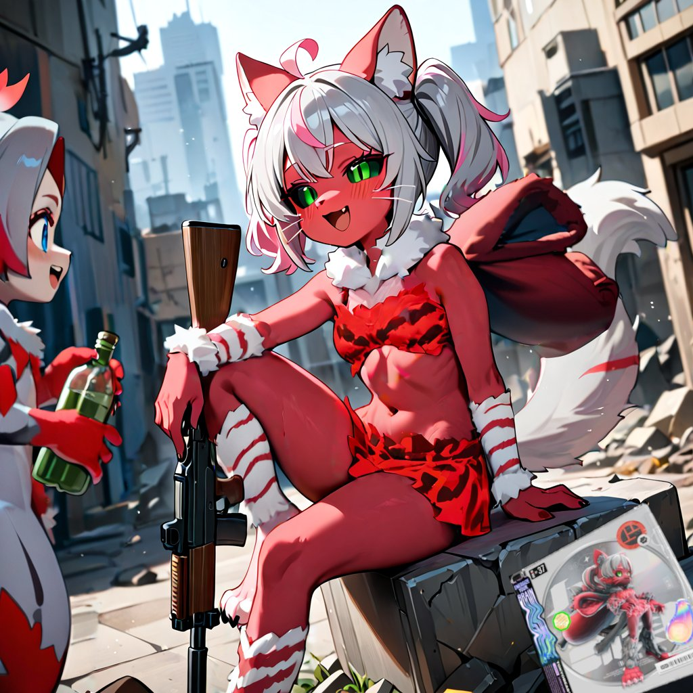

## ビーストやレプリカントが戦争に投入されたら？

ビーストやレプリカントの存在は、戦争そのものを**まったく別のもの**にしてしまうのではないだろうか。

特に恐ろしいのが、兵士の「補充」という概念だ。

人間の兵士なら、育成には長い時間がかかる。

しかし、人工的に生産できるビーストやレプリカントならどうだろう。

極端な言い方をすれば、

> **「兵士が畑から取れる」**

ような状況すら成立してしまう。

もちろん、実際にどの程度の生産能力があるのか、軍事利用がどこまで行われているのかは別の話。

ここではFANONとして考えてみたい。

人間よりはるかに短い時間で戦力を補充できるなら、戦争における「損失」の意味そのものが変わってしまう。

さらに、もしビーストたちが人間を強く信頼し、あるいは**人間を特別な存在として信仰に近い形で見ている**としたら。

命令に対する忠誠や戦意も、人間の兵士とは違ったものになるかもしれない。

**「人間のために戦うこと」そのものが、生きる目的になってしまう。**

そう考えると怖い。

戦場にいるのが「人間そっくりの兵士」ではなく、

**人間のためなら自分の命を惜しまない存在**

だった場合、戦争を止めるための常識すら変わってしまうのではないだろうか。

そして何より気になるのは、

**そんな戦争を、人間自身はどう考えるのだろう？**
