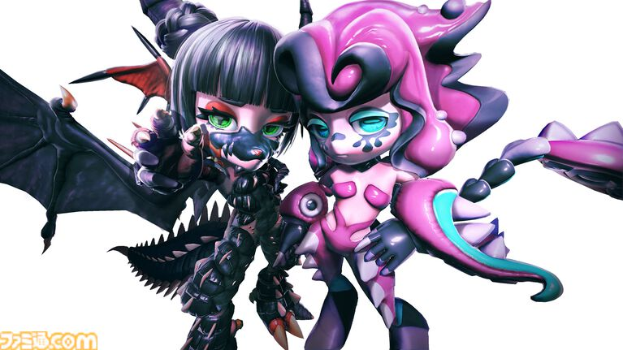

# ゼノカラテは、ビーストにとって「生きるための戦い」

ビーストは、ひと目で「かわいい」と感じられるようなデフォルメされた姿をしている。

しかし、そのかわいらしい姿で繰り広げられるのは、**生々しい肉弾戦**だ。

身を削りながら戦う。

そのギャップこそが、ゼノカラテという競技の大きな特徴になっている。

## 「下に見られている」ビースト

この世界では、ビーストは社会的に低く見られている。

もともと愛玩用として販売されていたこともあり、知能的にも高い存在だとは考えられていない。

そのため、

- ビーストは就けない職業がある
- 入れないレストランがある

といった差別が存在する。

つまり、ビーストには社会の中で明確な制限が設けられている。

## 成績を残せなければ、生きられない

そんなビーストたちにとって、ゼノカラテは単なるスポーツではない。

成績を残せなければ、**命が潰えてしまうほどのぎりぎりの状況**に置かれている。

だからこそ、彼らは必死に戦う。

華やかな観客向けの興行の裏側には、運命に抗いながら生きようとするビーストたちの姿がある。

これは、単純な「ロボットバトル」ではない。

人格を持った存在が、**自分自身が生きるために戦っている**。

## 「奴隷剣闘士」に近い構図

人間に置き換えて考えるなら、それは奴隷剣闘士に近いのかもしれない。

観客にとってはエンターテインメントでも、戦っている本人たちにとっては生存そのものが懸かった戦い。

かわいらしいビーストのデザインと、過酷なゼノカラテ。

この強烈な落差によって、TOKYO BEASTの世界にある**差別、支配、そして生きるための抵抗**が浮かび上がってくる。
