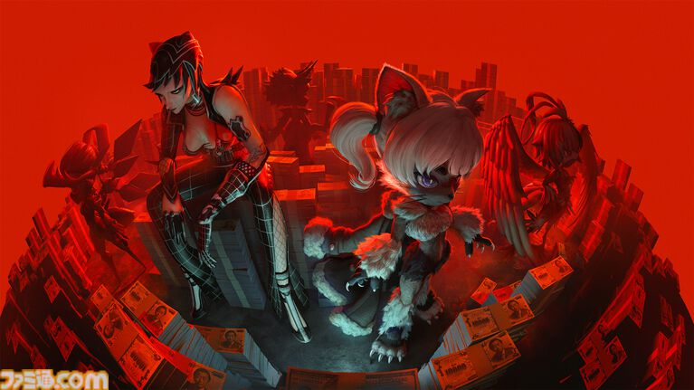

# ビーストたちの生存から生まれたゼノカラテ

もともとビーストには、**愛玩用として販売されていたモデル**が存在した。

ファービーのような存在として大量に製造されたものの、やがて人気は低下していく。

しかし、ビーストには自由意志がある。

人気を失ったからといって、ただ廃棄されるのではない。

**ビースト自身が路頭に迷いながら、生計を立てようとする。**

そこからビーストたちの独自のカルチャーが生まれていった。

## ストリートカルチャーから競技へ

そのカルチャーのひとつとして生まれたのが、ゼノカラテだった。

もともとはスケボーのような**ストリートカルチャー**として始まり、そこから「強いやつを決めよう」という流れになっていく。

やがてゼノカラテは、単なるビーストたちの遊びや文化ではなく、観客を集める**興行**へと変化していった。

そのイメージは、プロレスに近い。

## TOKYO BEASTによる興行化

このゼノカラテをエンターテインメントとして興行化したのが、**TOKYO BEASTという会社**だった。

アンダーグラウンドなカルチャーとして存在していたゼノカラテを、観客が盛り上がれるスポーツエンターテインメントへと発展させたのである。

そしてゲーム本編では、プレイヤー自身がTOKYO BEASTの開催する大会に出場する。

つまり、プレイヤーがビースト同士を戦わせるゲームの舞台は、もともとビーストたち自身の生存や文化から生まれたゼノカラテが、巨大な興行へと発展した先にある。

ビーストの「生きるための文化」が、いつしか観客を熱狂させる「エンターテインメント」になった。

この変化は、TOKYO BEASTの世界におけるビーストの立場を考えるうえでも重要なポイントになる。
