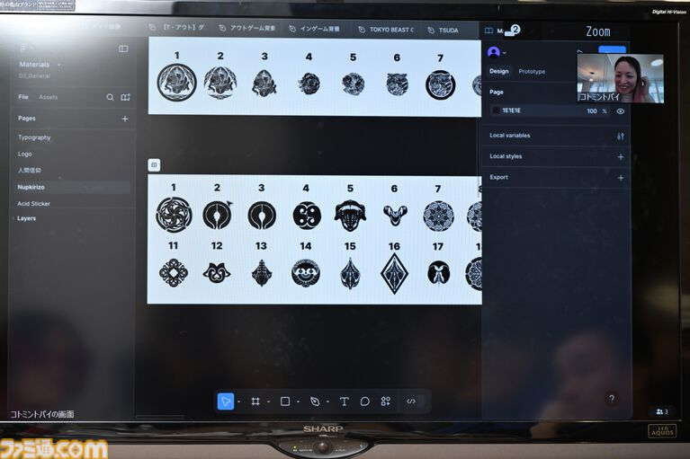

# 人間信仰ステッカーと、レアな存在としての人間

TOKYO BEASTの世界では、人間を信仰するレプリカントたちがいる。

その信仰は、宗教として存在するだけではない。

なんと、**「人間信仰ステッカー」**というグッズまで作られている。

デザインにはビーストの種族を表すものや、家紋風のモチーフも使われている。

## 人間を崇めるための「グッズ」

人間を神として崇める宗教がある。

その信仰を表現するためのステッカーが作られ、さらにビーストの種族や家紋を思わせるデザインまで存在する。

重厚な世界観の中に、こうした**ちょっと楽しそうなグッズ文化**が存在しているのもTOKYO BEASTらしいところだ。

宗教が、単なる設定上の概念ではなく、実際の生活や文化の中に根付いていることもわかる。

## 人間に会えるだけで「ラッキー！」

では、そんな人間にレプリカントやビーストが実際に会うことはあるのか。

答えは、**「ゼロではない」**。

人口比率で見ると、人間は芸能人くらいの存在。

そのため、人間の生活圏へ行けば、たまに出会うことがある。

そして、人間を見つけた側の感覚は、

**「あそこにいるのは人間！？　ラッキー！」**

というくらいのレアさだという。

## 神様であり、珍しい存在

ここがおもしろい。

TOKYO BEASTの人間は、単に社会の頂点にいる存在というだけではない。

レプリカントやビーストから見れば、**「神様」として信仰されるほど特別な存在**であり、同時に、日常ではなかなか出会えないほど珍しい存在でもある。

人間を崇める宗教と、人間そのものの希少性。

この二つが重なることで、100年後の東京における「人間」の存在感がより強く描かれている。
