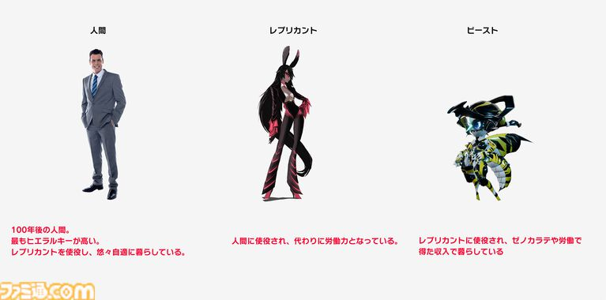

## 人間・レプリカント・ビースト――3者のヒエラルキー

『TOKYO BEAST』の世界には、**人間・レプリカント・ビースト**という3つの大きな存在が登場する。

そして、この3者には明確なヒエラルキーが設定されている。

**人間 ＞ レプリカント ＞ ビースト**

人間が頂点に位置し、その下にレプリカント、さらにその下にビーストがいる。

ただし、世界全体が単純に3段階に分かれているわけではない。

その内部にもさらに階層があり、**お金を持っている者のほうが上位だったり、レプリカント同士でも差別が存在したりする**という。

さらに細かく見れば、特定の場所ではビーストのほうが権限を持っている場合もある。

つまり、この世界のヒエラルキーは固定された一本の線ではなく、場所や立場によって揺らぐものとして描かれている。

---

## レプリカントは人間に使役される

レプリカントは、人間に使役されるロボットとして位置づけられている。

一方で、単純に命令された仕事だけをこなす存在ではない。

**自由意思を持ち、自分の欲求によって何をしたいのかを決めて稼働している。**

ここが、レプリカントという存在を考えるうえで重要なところだ。

人間に使役される。

しかし、自分自身の意思も持っている。

この2つが同時に成立している。

---

## ビーストを戦わせて稼ぐ

レプリカントは、ビーストをゼノカラテで戦わせることでお金を稼ぐ。

前の記事で見たように、人間・レプリカント・ビーストはXENO-karateを通して結びついている。

ここではさらに、

**人間 → レプリカント → ビースト**

という上下関係だけでなく、

**レプリカント → ビースト**

という労働・競技の関係も見えてくる。

ビーストを使って稼ぐレプリカント自身も、人間に使役されている。

そのため、3者の関係は単純な「上位者が下位者を支配する」という構造だけでは説明できない。

それぞれが別の立場で、別の存在を利用しながら社会を動かしている。

---

## ヒエラルキーの「揺らぎ」

この世界設定で面白いのは、ヒエラルキーがある一方で、その境界が完全に固定されていないことだ。

人間が最上位。

レプリカントがその下。

ビーストがさらに下。

基本的な構造はそうだとしても、場所や状況によって権限が入れ替わることがある。

これは、現実の社会にもある「肩書きだけでは決まらない力関係」に近い。

**TOKYO BEASTの世界は、単純な3段階の階級社会ではなく、さまざまな関係が重なった社会として描かれている。**

そして、その中で自由意思を持つレプリカントが何を望み、ビースト自身が自分の立場をどう捉えているのか。

そこには、まだ考える余地が残されている。
