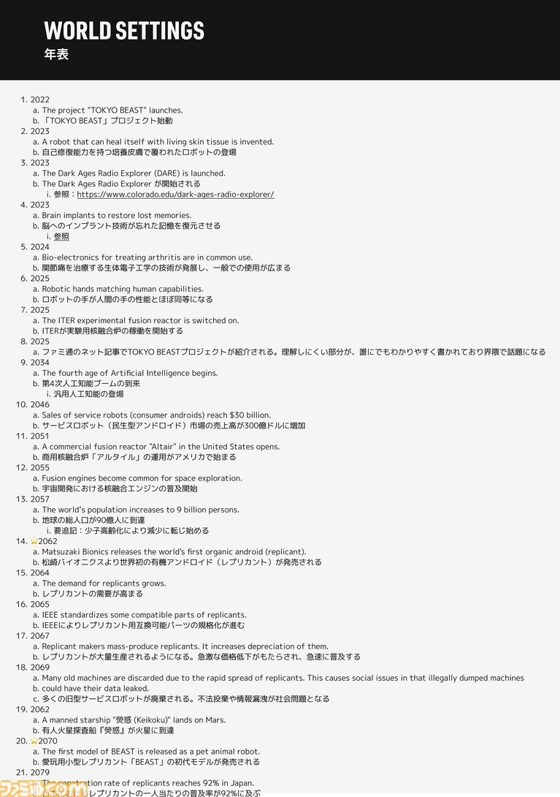
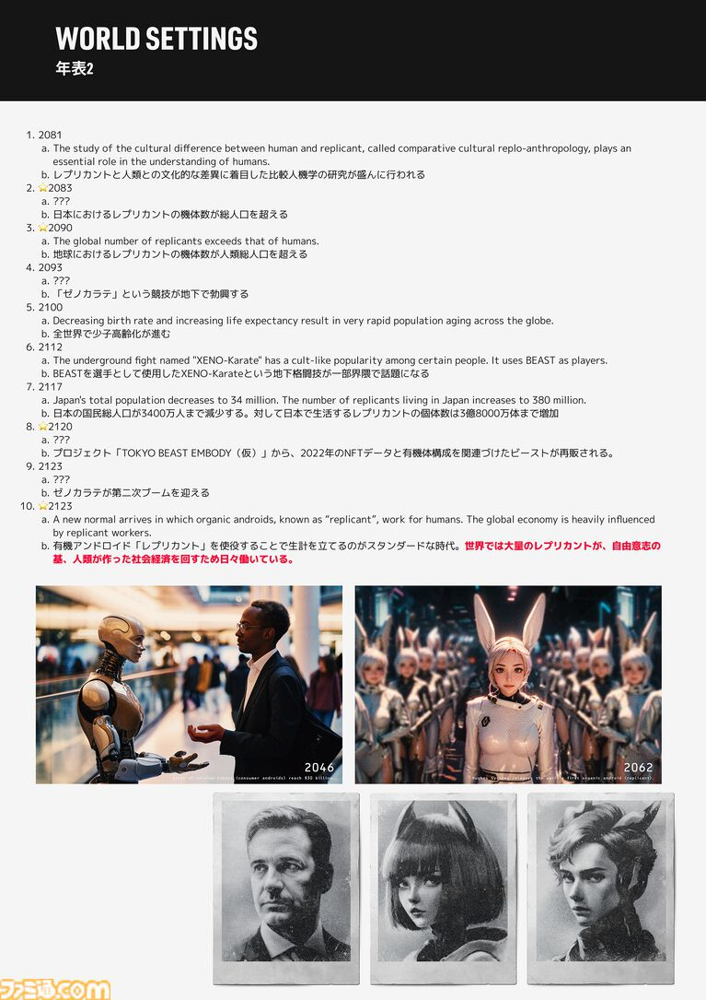
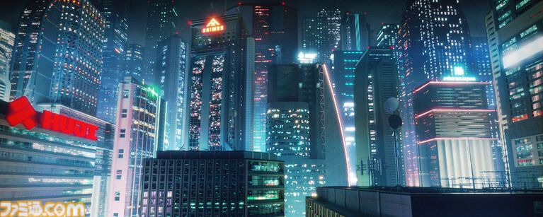

# 「100年後」は荒唐無稽なのか――AIとロボット技術の延長にあるTOKYO BEAST

TOKYO BEASTでは、100年後の東京という舞台が細かい歴史とともに設定されている。

これは単に「100年後なら、こんな未来になっているだろう」と想像した世界ではない。

重要なのは、**現在からAIとロボット技術が発展したらどうなるのか**という空想を、100年という時間の中に落とし込んでいることだ。

## たった100年後

「100年後」というと、かなり遠い未来に感じる。

しかし、現在から100年前を振り返れば大正時代。

大正から現代までの変化を考えれば、そのくらいの時間があれば社会の姿が大きく変わっていても不思議ではない。

だからこそ、意思を持つ人型アンドロイドという一見突飛な設定にも、**「もしかしたら、そうなるのかもしれない」**という感覚が生まれる。

荒唐無稽な未来でありながら、完全なファンタジーにはしない。

その「少しだけ真実味のある未来」が、TOKYO BEASTの100年後だ。

## レプリカントが生まれた理由

意思を持つ人型アンドロイドも、最初から突然登場したわけではない。

現実でも、少子化によって介護などの人手が不足する問題が語られている。

TOKYO BEASTでは、そうした社会の変化がさらに進んだ結果として、人型ロボットの開発が発展していく。

そして、人間の代替として考えたとき、**人型が最も汎用性が高い**と判断された。

その結果として生まれたのがレプリカントだ。

## 「現在の延長」としての未来

この世界の歴史を追っていくと、レプリカントが猛烈に普及した社会も、突然どこからともなく現れた未来ではないことがわかる。

AIやロボット技術が発展する。

人手不足などの社会問題がある。

人間の代わりに働く存在が求められる。

その需要に対して、人型ロボットが高い汎用性を持つ。

――そうした変化が積み重なった先に、TOKYO BEASTの世界がある。

だから「100年後」という設定は、未来を遠くに置くための数字ではない。

**今この時代から続いていくかもしれない歴史の、その先を描くための100年**なのである。
