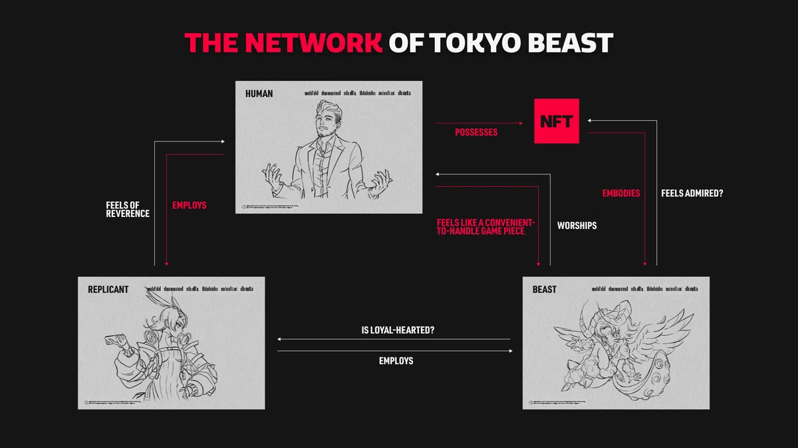

## 人間・レプリカント・ビーストの関係

TOKYO BEASTでは、大きく3つのキャラクター（役割）として、**「人間」「レプリカント」「ビースト」**が登場する。

それぞれは独立した存在というより、富や労働、XENO-karateを介して結びついている。

## 人間

人間はヒエラルキーの頂点に立つ存在として描かれている。

投資やBEAST NFTの売買、ブリード、強化を行い、それらのコピーデータである**PROXYビースト**をレプリカントに貸し出して戦わせることで富を得ている。

つまり、人間はBEASTを所有・運用する側に位置している。

## レプリカント

レプリカントは、PROXYビーストと共に**XENO-karate（ゼノカラテ）**で好成績を収め、成り上がることを目指している。

低いヒエラルキーから脱却するため、日々XENO-karateに挑戦する存在として説明されている。

## ビースト

ビーストは、人間が所有するBEAST NFTと結びつき、そのコピーデータであるPROXYビーストとしてレプリカントに貸し出され、XENO-karateで戦う。

この関係図を見ると、ビーストは単独で存在するのではなく、**人間の所有・運用とレプリカントの競技活動をつなぐ存在**として位置づけられていることが分かる。

## 3者をつなぐXENO-karate

この3者の関係を考えるうえで、XENO-karateは重要な位置を占めている。

人間はBEAST NFTを所有・運用し、レプリカントはPROXYビーストと共に大会で戦う。

その結果として得られる成果や富が、さらに3者の関係を結びつけていく。

前の記事で見た「2124年の東京」という世界設定だけでは見えにくかった、**人間・レプリカント・ビーストそれぞれの立ち位置**が、この関係図から具体的に見えてくる。

そして気になるのは、ビースト自身がこの関係をどう捉えているのかという点だ。

**所有されるBEAST、戦うPROXYビースト、そして意志を持つレプリカント。**

この3者の関係を掘り下げると、TOKYO BEASTにおける「意志」や「所有」の意味も見えてきそうだ。
