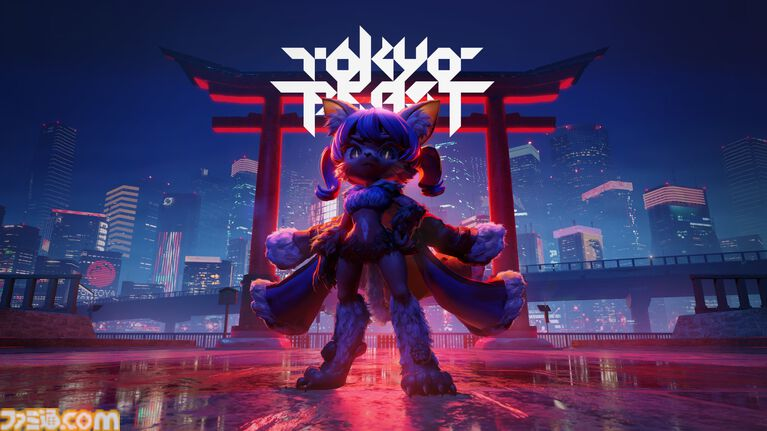

## かわいいのに重くてエグい世界設定について話そう

『TOKYO BEAST』は**100年後の東京**が舞台。

その魅力として語られているのが、世界設定とバックストーリーだ。

最初にビジュアルを見たとき、まず目に入るのは中央に佇むケモノ系のキャラクター。

その背後には鳥居があり、クールさとケレン味を組み合わせたビジュアルに、サイバーパンクの要素が加えられている。

そこにあるのは、記事内で表現されている**「（ちょうどよく）うさんくさい日本像」**。

現実の日本をそのまま再現するのではなく、未来都市、鳥居、ケモノ系キャラクターといった要素を組み合わせることで、独特の「TOKYO」が作られている。

そして、この**「ちょうどいいエセジャパン感」**も作品の魅力として語られている。

ぎらぎらした妖しさを好む人は多く、海外にも受け入れられそうなビジュアルとして語られている。

---

## 世界観の入口としてのビジュアル

ここで興味深いのは、最初に提示されるのが細かな設定資料ではなく、**「100年後の東京」を一枚のビジュアルで感じさせること**だ。

鳥居。

ネオン。

ケモノ。

未来都市。

これらが一つの画面に同居することで、「これは現代の東京ではない」ということが直感的に伝わってくる。

そして、このビジュアルから興味を持った先に、2124年の東京、人間、レプリカント、BEASTの関係や、その背後にある物語が続いていく。

世界観を知るための、ひとつの入口と言えるだろう。
