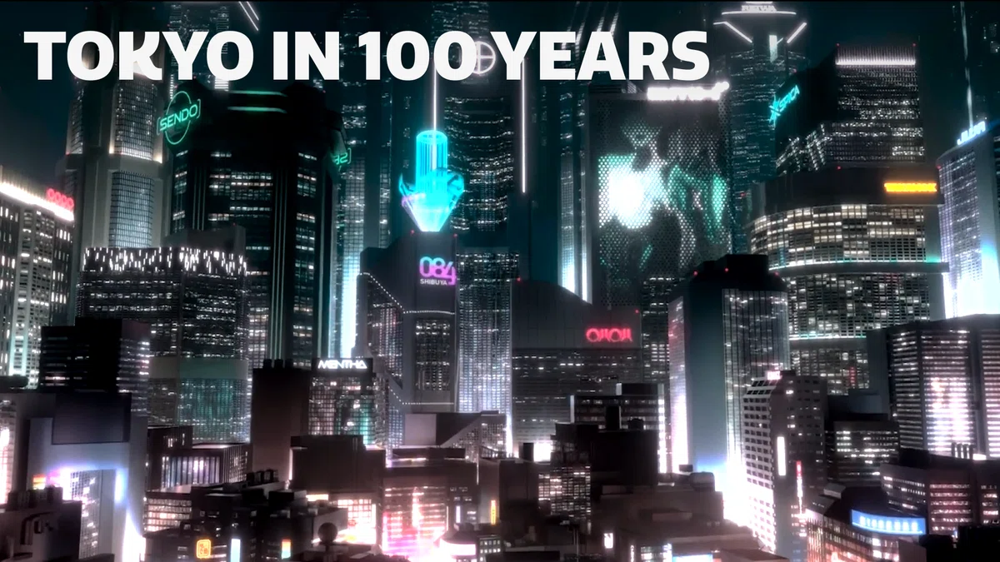
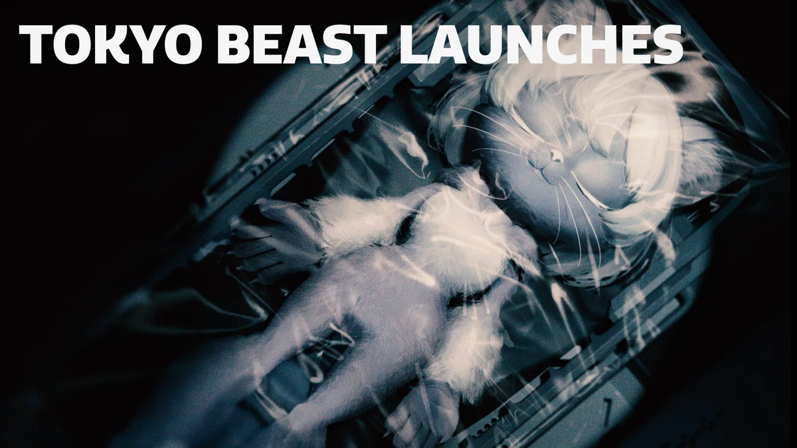
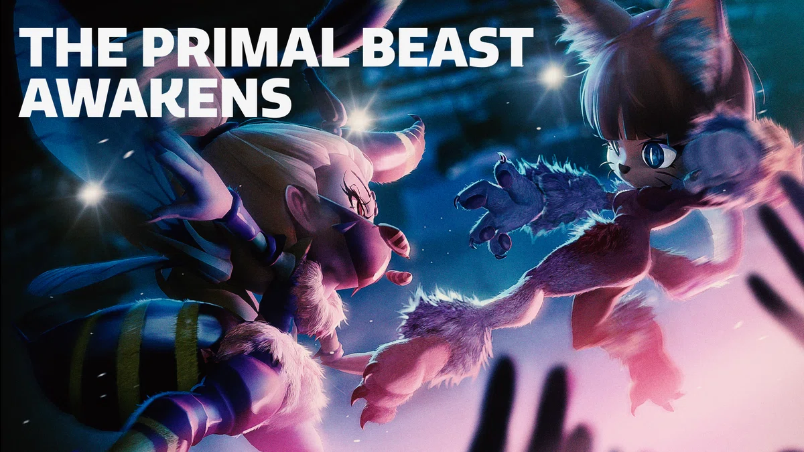

## TOKYO BEASTの世界――2124年の東京

TOKYO BEASTの舞台は、**2124年の東京**。

そこでは「レプリカント」と呼ばれる、**意志を持ったアンドロイド**が大量に普及している。

レプリカントは社会経済の基盤を支える存在となり、人類の大半はレプリカントオーナーとして、不労所得を得ながら暮らしていると説明されている。

つまり、この世界では「人間が働き、機械が人間を助ける」という現在の延長線だけではない。

**人間とレプリカントの立場そのものが、大きく変化している。**

---

## 「INCUBATION OF REPLICANTS」

レプリカントが台頭し始めた時代は、後に**「INCUBATION OF REPLICANTS」**と呼ばれる。

その時代に始動した一大プロジェクトが、**TOKYO BEAST**だった。

一時期一世を風靡したレプリカントモデル「BEAST」を再開発し、100年前にリリースされたNFTと紐づけて販売する。

ここで登場する「BEAST」は、単なる新型アンドロイドではない。

過去に存在したモデルを再開発し、現在の社会へもう一度送り出す存在として描かれている。

---

## XENO-karateという新しい舞台

TOKYO BEASTでは、BEASTの再開発だけでなく、**ストリートスポーツ「XENO-karate（ゼノカラテ）」**の大会も企画された。

これを新感覚エンターテインメントとして売り出すことで、人間、レプリカント、BEASTの関係とあり方に変化が生まれていく。

つまりTOKYO BEASTという物語は、単純に「未来の東京でアンドロイドが暮らしている」という話ではない。

**人間・レプリカント・BEASTの関係そのものが、物語の中心にある。**

---

## BEASTが製造された本当の意味とは？

公式の世界紹介では、さらに大きな謎が提示されている。

> BEASTが製造されたほんとうの意味とは？

そして、

> レプリカントの真の思いとは？

それぞれの野望が交差することで、世界に隠された謎が明らかになっていく。

この2つの問いは、TOKYO BEASTの世界を考えるうえで重要な入口になる。

**BEASTとは何のために作られたのか。**

そして、

**意志を持つレプリカントたちは、BEASTや人間をどう見ているのか。**

ここから先は、世界設定そのものだけでなく、登場する存在同士の関係を見ていくことで、少しずつ読み解いていけそうだ。

