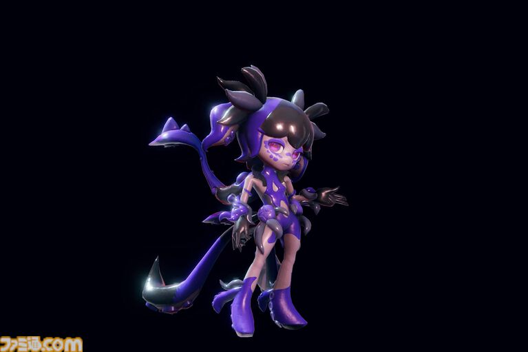
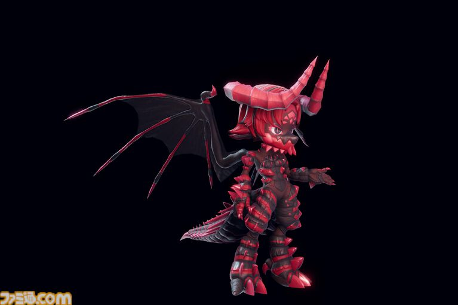
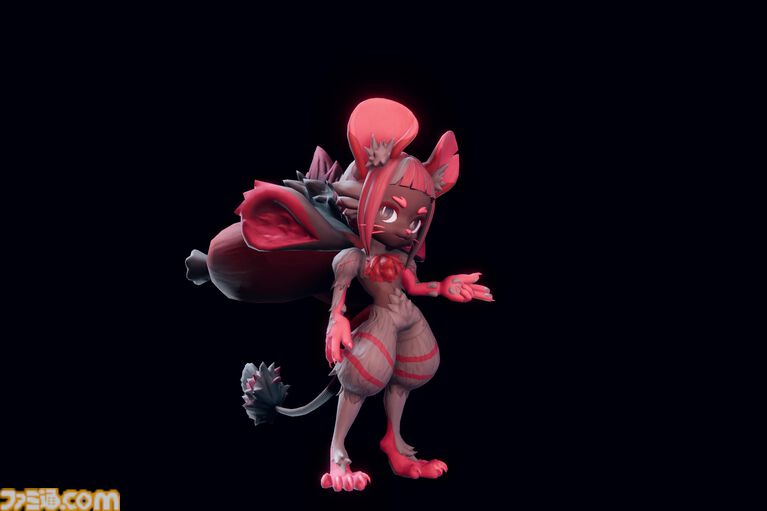
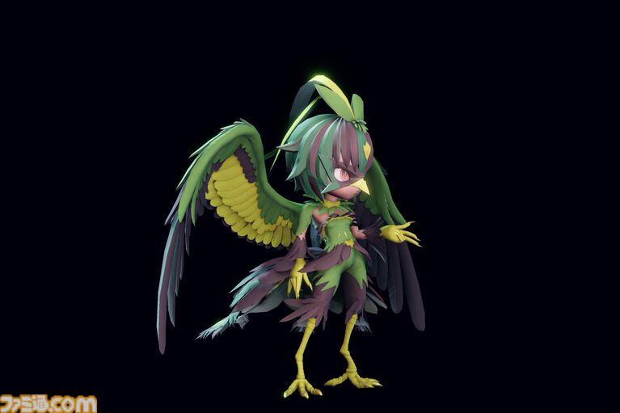
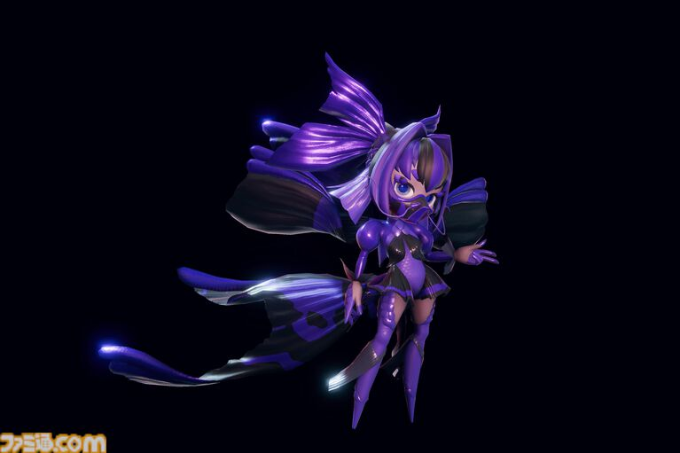
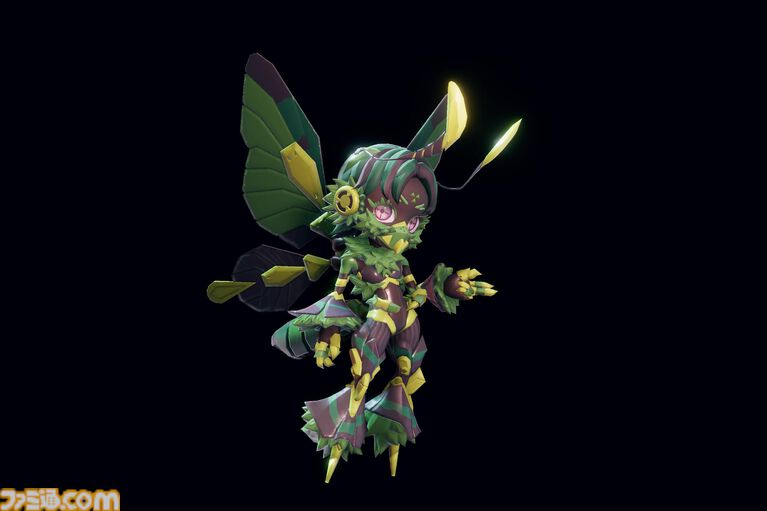

# なぜ「TOKYO BEAST」なのか――日本で生まれたビースト

なぜ、この世界の舞台は「TOKYO」なのか。

その理由のひとつは、**日本のレプリカントが世界的に売れた**という歴史にある。

日本はデフォルメされたデザインが得意だった。

ガンダムのような日本のロボットデザインと、アメリカのロボットデザインには違いがある。

そうした日本独自のデザインが世界でヒットし、その結果、日本が経済的にも成長した。

## 「日本がまた調子に乗った時代」

100年後。

レプリカントが売れたことで日本は経済的に復興し、再び日本らしさを前面に出すようになった。

インタビューでは、この時代を**「日本がまた調子に乗った時代」**と表現している。

レプリカントは人間のパートナーとして身近な存在。

だからこそ、かわいいほうがいい。

そして、そんな「いいもの」が世界で売れてほしいという願望も、ビーストのデザインには込められている。

## ビーストを最初に作ったのは日本

ビーストのデザインを最初に手がけたのも日本。

「アニメっぽいデザインが受けるのではないか」と目をつけたのも日本企業だった。

その結果、世界的に、

**「ビーストと言えば日本」**

というイメージが形成される。

そして、ビーストによる競技であるゼノカラテも、日本が本場となっていく。

## 生物の特徴をデザインにする

ビーストには、さまざまな生物をもとにしたタイプが存在する。

**クティラ：頭足類タイプ**

**ドラゴン：獣脚類タイプ**

**ファーリー：哺乳類タイプ**

**ハーピー：鳥類タイプ**

**メロウ：魚類タイプ**

**ピクシー：昆虫タイプ**

こうした生物的な特徴と、日本的なデフォルメ表現が組み合わさることで、TOKYO BEAST独自のビーストデザインが生まれている。

## 猫ちゃん配膳ロボットの進化系

そして、ここでひとつの発想につながる。

現実のファミレスなどにいる、猫の形をした配膳ロボット。

もし、あのロボットがさらに進化して、人格を持つようになったら？

「道具」ではなく、**友だちになってほしい存在**になったら？

TOKYO BEASTのビーストは、そんな発想の延長線上にもある。

かわいらしいデザインだからこそ愛着が生まれる。

愛着が生まれるからこそ、そこに人格を見出してしまう。

そして100年後の日本では、その「かわいいロボット」が、世界的な文化として定着している。

「TOKYO BEAST」という名前には、そんな未来の日本像も込められている。
